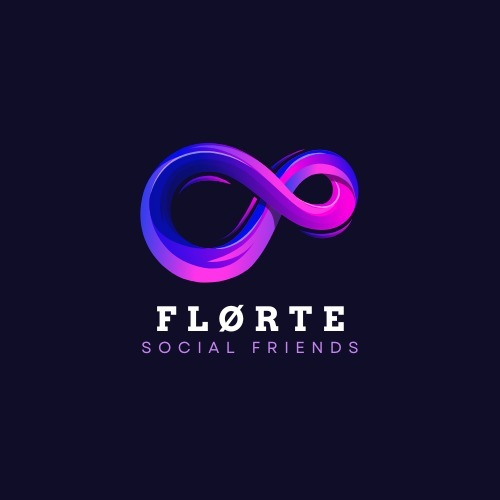

## Florte
 

# Florte

Florte es una red social diseñada para conectar personas del sena especialmente del complejo sur medioante el sistema del gps el cual te mostrara aprendices de ese entorno , comunidades de tecnologia , electricidad y demas tecnologos y tecnicos que se realizan en el complejo sur tambien ayuda a  compartir ideas entre ellos mismos , Este proyecto busca ofrecer una plataforma moderna, segura y fácil de usar.

## Características principales

- Publicación de mensajes, imágenes , comunidades
- Sistema de comentarios y reacciones
- Perfiles de usuario personalizables y adjuntables para tus proyectos
- Búsqueda y seguimiento de otros usuarios por medio de geolocalizacion 
- Notificaciones en tiempo real

## Instalación

```bash
git clone https://github.com/tu-usuario/florte.git
cd florte
# Instala las dependencias según el stack tecnológico usado
```

## Uso

1. Configura las variables de entorno necesarias.
2. Ejecuta el servidor de desarrollo.
3. Accede a la aplicación desde tu navegador.

## Contribución

Las contribuciones son bienvenidas por parte de los integrantes de Lyar . Por favor, abre un issue o envía un pull request.


